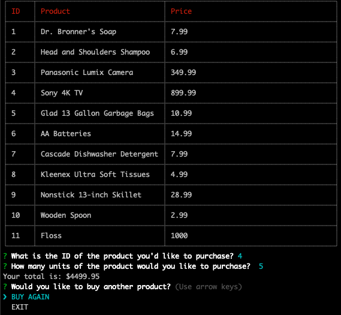
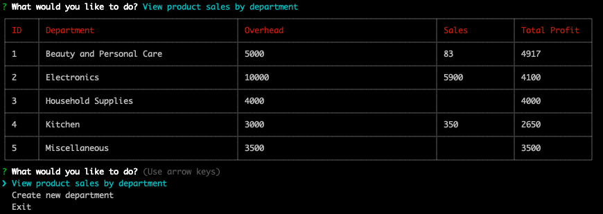

# Storefront

Storefront is a command line-based CRUD application that simulates the experience of online shopping. The application addresses three user stories: store buyer, store manager, and store supervisor. 

## Getting Started

The instructions below will allow you to demo this project on your local machine. 

### Prerequisites

Have access to your terminal and basic familiarity with node.js

### Installing

After cloning to your local machine, run the following within the directory in your terminal: 

```
npm install 
```

Note that bamazonCustomer.js corresponds to the store buyer experience, bamazonManager.js corresponds to the store manager experience, and bamazonSupervisor.js corresponds to the store supervisor experience. To intiate the program for any of these experiences, enter the following prompts into your command line: 

```
node bamazonCustomer.js 
```

```
node bamazonManager.js 
```

```
node bamazonSupervisor.js 
```

## Running Storefront 

Storefront addresses three user stories: 
- Store Buyer
- Store Manager
- Store Supervisor 

As a store buyer, you can purchase goods displayed in a table and specify a quantity. The total will be displayed after you make you purchase. As a store manager, you can view products for sale, view low inventory, add to an existing product's inventory, or add a new product entirely. As a store supervisor, you can view product sales by department and create new departments. For each user, all relevant values are updated in the mySQL database. 

## Demo of Storefront


View full video demo [here](https://drive.google.com/file/d/1KCvt0Nez8vlKvDrxIURTDVsOPlG61c3N/view). 

An example of what the store looks like for the customer: 

```
node bamazonCustomer.js
```



An example of what the store looks like for the supervisor:

```
node bamazonSupervisor.js
```



## Built With

* [Node.js](https://nodejs.org/en/) - JavaScript runtime 
* [MySQL](https://www.mysql.com/) - Used to store store data
* [Inquirer](https://rometools.github.io/rome/) - Used to prompt users and navigate applications
* [CLI Table](https://www.npmjs.com/package/cli-table3) - Used to render unicode-aided tables on the command line

## Author

* **Tomas Gear** - *https://github.com/nexio-t* - [Storefront Repository](https://github.com/nexio-t/storefront)

